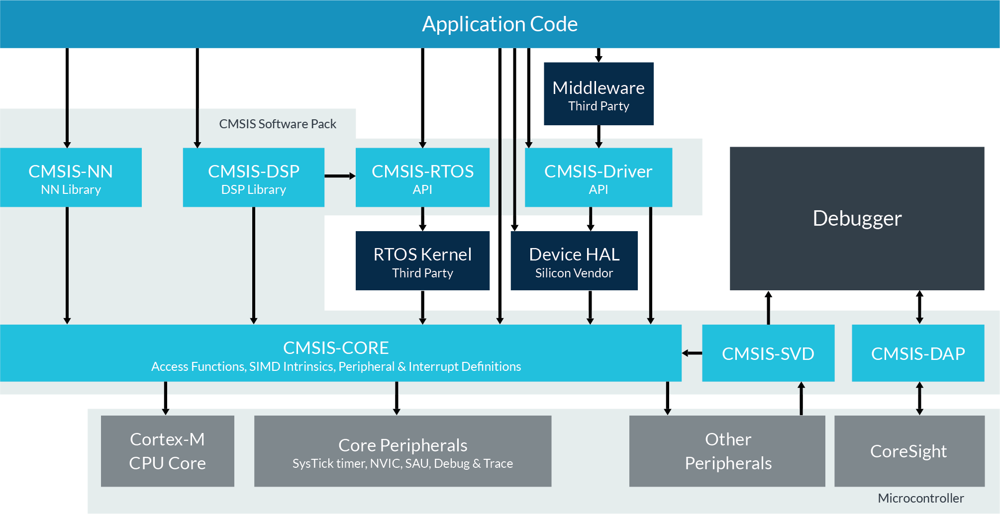

# CMSIS

CMSIS enables consistent device support and simple software interfaces to the processor and its peripherals, simplifying software reuse, reducing the learning curve for microcontroller developers, and reducing the time to market for new devices.

## Overview

Starting from CMSIS-CORE, a vendor-independent hardware abstraction layer for Cortex-M processors, CMSIS has since expanded into areas such as software component management and reference debugger interfaces. Creation of software is a major cost factor in the embedded industry. Standardizing the software interfaces across all Cortex-M silicon vendor products, especially when creating new projects or migrating existing software to a new device, means significant cost reductions.

CMSIS is defined in close cooperation with various silicon and software vendors and provides a common approach to interface to peripherals, real-time operating systems, and middleware components. It simplifies software reuse, reducing the learning curve for new microcontroller developers and cutting the time-to-market for devices.



## Components

CMSIS including seven parts and each part has its specific functionality.

> **Note** More details about CMSIS to see [here](https://developer.arm.com/embedded/cmsis).

* [CMSIS-RTOS](http://arm-software.github.io/CMSIS_5/RTOS2/html/index.html) is an API that enables consistent software layers with middleware and library components
* [CMSIS-DSP](http://arm-software.github.io/CMSIS_5/DSP/html/index.html) library is a rich collection of DSP functions that Arm has optimized for the various Cortex-M processor cores
* [CMSIS-Driver](http://arm-software.github.io/CMSIS_5/Driver/html/index.html) interfaces are available for many microcontroller families
* [CMSIS-Pack](http://http//arm-software.github.io/CMSIS_5/Pack/html/index.html) defines the structure of a software pack containing software components
* [CMSIS-SVD](http://http//arm-software.github.io/CMSIS_5/SVD/html/index.html) files enable detailed views of device peripherals with current register state
* [CMSIS-DAP](http://http//arm-software.github.io/CMSIS_5/DAP/html/index.html) is a standardized interface to the Cortex Debug Access Port \(DAP\)
* [CMSIS-NN](http://arm-software.github.io/CMSIS_5/NN/html/index.html) is a collection of efficient neural network kernels

## Source Code

CMSIS is publicly developed on GitHub, you can fork/clone it [here](https://github.com/ARM-software/CMSIS_5/releases).

## Release Notes

Below is the newest release notes `5.4.0`.

```text
CMSIS-Core(M): 5.1.2

Added Cortex-M1 support (beta).
CMSIS-Core(A): 1.1.2

Removed using get/set built-ins FPSCR in GCC >= 7.2 due to shortcomings.
Fixed co-processor register access macros for Arm Compiler 5.
CMSIS-DAP: 2.0.0

CMSIS-DSP: 1.5.2

CMSIS-Driver: 2.6.0

Flash Driver API V2.2.0
CMSIS-NN: 1.1.0

Added new math functions.
CMSIS-RTOS2: 2.1.3

Additional functions allowed to be called from Interrupt Service Routines:
osThreadGetId
RTX 5.4.0
Added support for Event Recorder initialization and filter setup.
Added support to use RTOS as Event Recorder Time Stamp source.
Fixed osDelayUntil longest delay (limited to 2^31-1).
Fixed optimization issue when using GCC optimization level 3.
Fixed osMemoryPoolAlloc to avoid potential race condition.
Restructured exception handling for Cortex-A devices.
Minor code optimizations (removed unnecessary checks).
Utilities

SVDConv 3.3.21
PackChk 1.2.71
```

