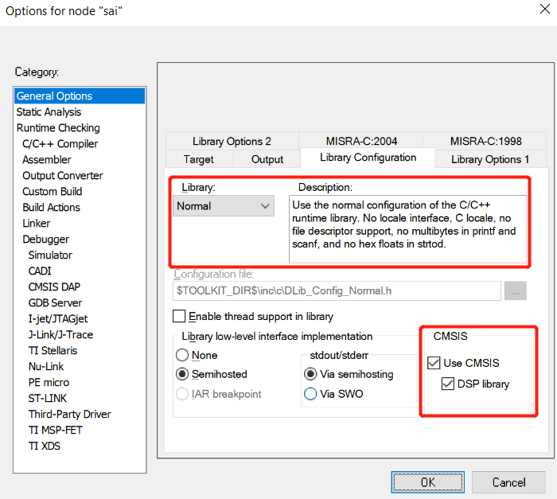

# CMSIS DSP

## Introduction

[**CMSIS-DSP**](https://github.com/ARM-software/CMSIS_5/tree/5.4.0/CMSIS/DSP/Source) library is a rich collection of DSP functions that Arm has optimized for the various `Cortex-M` processor cores. CMSIS-DSP is widely used in the industry and enables also optimized C code generation from various third-party tools.

The library is divided into a number of functions each covering a specific category:

* Basic math functions
* Fast math functions
* Complex math functions
* Filters
* Matrix functions
* Transforms
* Motor control functions
* Statistical functions
* Support functions
* Interpolation functions

The library has separate functions for operating on `8-bit integers, 16-bit integers, 32-bit integer and 32-bit floating-point values`.

## Using the Library

The library installer contains pre-built versions of the libraries in the Lib folder.

```text
arm_cortexM7lfdp_math.lib (Cortex-M7, Little endian, Double Precision Floating Point Unit) 
arm_cortexM7bfdp_math.lib (Cortex-M7, Big endian, Double Precision Floating Point Unit) 
arm_cortexM7lfsp_math.lib (Cortex-M7, Little endian, Single Precision Floating Point Unit) 
arm_cortexM7bfsp_math.lib (Cortex-M7, Big endian and Single Precision Floating Point Unit on) 
arm_cortexM7l_math.lib (Cortex-M7, Little endian) 
arm_cortexM7b_math.lib (Cortex-M7, Big endian) 
arm_cortexM4lf_math.lib (Cortex-M4, Little endian, Floating Point Unit) 
arm_cortexM4bf_math.lib (Cortex-M4, Big endian, Floating Point Unit) 
arm_cortexM4l_math.lib (Cortex-M4, Little endian) 
arm_cortexM4b_math.lib (Cortex-M4, Big endian) 
arm_cortexM3l_math.lib (Cortex-M3, Little endian) 
arm_cortexM3b_math.lib (Cortex-M3, Big endian) 
arm_cortexM0l_math.lib (Cortex-M0 / Cortex-M0+, Little endian) 
arm_cortexM0b_math.lib (Cortex-M0 / Cortex-M0+, Big endian) 
arm_ARMv8MBLl_math.lib (Armv8-M Baseline, Little endian) 
arm_ARMv8MMLl_math.lib (Armv8-M Mainline, Little endian) 
arm_ARMv8MMLlfsp_math.lib (Armv8-M Mainline, Little endian, Single Precision Floating Point Unit) 
arm_ARMv8MMLld_math.lib (Armv8-M Mainline, Little endian, DSP instructions) 
arm_ARMv8MMLldfsp_math.lib (Armv8-M Mainline, Little endian, DSP instructions, Single Precision Floating Point Unit)
```

The library functions are declared in the public file arm\_math.h, which is placed in the Include folder. Simply include this file and link the appropriate library in the application and begin calling the library functions. The Library supports single public header file arm\_math.h for Cortex-M cores with little endian and big endian. Same header file will be used for floating point unit\(FPU\) variants. Define the appropriate preprocessor macro `ARM_MATH_CM7` or `ARM_MATH_CM4` or `ARM_MATH_CM3` or `ARM_MATH_CM0` or `ARM_MATH_CM0PLUS` depending on the target processor in the application. For Armv8-M cores define preprocessor macro `ARM_MATH_ARMV8MBL` or `ARM_MATH_ARMV8MML`. Set preprocessor macro `__DSP_PRESENT` if Armv8-M Mainline core supports DSP instructions.

## Potential Issues

There is a warning occurs in `CMSIS/DSP_Lib/Source/TransformFunctions/arm_cfft_radix4_q31.c: In function 'arm_radix4_butterfly_q31'`.

```c
Warning: dereferencing type-punned pointer will break strict-aliasing rules [-Wstrict-aliasing] xaya = *_SIMD64(ptr1)+;
```

This function to be called only in `hexiware_heartrate` project use this function to do FFT, which including source code file directly not the library, which like `../../CMSIS/Lib/GCC/libarm_cortexM4lf_math.a`, generated by ARM 's project using `GCC` compiler.

## Reasons

The reason why this warning occurs is that `GCC` project ignore those warnings directly during the library generation process and we didn't use the parameter, `-fno-strict-aliasing`, to ignore those warnings in our `GCC` project, so we can add this parameter, `-fno-strict-aliasing`, to ignore it, and ARM gives a suggestion to fix those warnings but this resolution will not be added into the official release version.

Now ARM CMSIS official release version is 5.4 and ours is 5.3, we can update it in next SDK release, but this update would not fix those warnings, and ARM's suggestion is that users should use official library throuth include arm\_math.h with library , not with the original source code.

## Resolution

Simply include this file, `arm_math.h`, and link the appropriate library in the application and begin calling the library functions.

## How to make a project to including specific CMSIS DSP library

Our project is generated by ruby generator, so need to configure `yml` file to include a specific CMSIS DSP library.

### Setting Steps

1. CMSIS DSP library yml setting in `C:\nxp_ksdk\mcu-sdk-2.0\CMSIS\CMSIS.yml`.
   1. Yml support three toolchains to require, `MDK/ARMGCC/MCUX`, without `IAR`.

      ```yaml
      CMSIS_DSP_Lib.arm_cortexM4lf_math:
        section-type: component
        meta-name: platform.CMSIS_DSP_Lib.arm_cortexM4lf_math
        contents:
          files:
          - source: CMSIS/Lib/ARM/arm_cortexM4lf_math.lib
            virtual-dir: libs
            toolchains: mdk
            attribute: extra-libraries
          - source: CMSIS/Lib/GCC/libarm_cortexM4lf_math.a
            virtual-dir: libs
            toolchains: armgcc kds mcux
            attribute: extra-libraries
        __requires__:
        - CMSIS_DSP_Lib.ui_control cmsis.core_cm4f.support
        component_info:
          common:
            type: CMSIS_driver
            version: 1.5.2
          cmsis_pack:
            class: CMSIS
            pack_name: CMSIS
            group: DSP
            pack_url: http://www.keil.com/pack/
            pack_vendor: ARM
            pack_version: 5.3.0
      ```

   2. IAR toolchain need use default library in IAR toolchain install path, `C:\Program Files (x86)\IARSystems\Embedded Workbench 8.1\arm\CMSIS\Lib\IAR\iar_cortexM4lf_math.a`, named with prefix `iar_`.
   3. Calling process for CMSIS yml
      * Specific SOC yml load specific SOC component yml. 
      * Specific SOC component yml load others yml. 
      * Others yml load CMSIS yml

### Examples

SAI project as example in platform twrk80f150m.

#### GCC/MDK/MCUX

1. Add required CMSIS DSP library, which named `CMSIS_DSP_Lib.arm_cortexM4lf_math` in `CMSIS.yml`, into SAI requires section for twrk80f150m.yml in `C:\nxp_ksdk\mcu-sdk-2.0\bin\generator\records_v1\msdk\projects\sdk_example\twrk80f150m.yml`.

```yaml
__requires__: 
  - driver.i2c driver.sgtl5000 CMSIS_DSP_Lib.arm_cortexM4lf_math
```

1. Build SAI project with `GCC` compiler and will link the specific CMSIS DSP library, `libarm_cortexM4lf_math.a`, into CMakelist.txt.

```text
link_directories(${ProjDirPath}/../../../../../CMSIS/Lib/GCC) 

target_link_libraries(sai.elf debug ${ProjDirPath}/../../../../../CMSIS/Lib/GCC/libarm_cortexM4lf_math.a) 

link_directories(${ProjDirPath}/../../../../../CMSIS/Lib/GCC) 

target_link_libraries(sai.elf optimized ${ProjDirPath}/../../../../../CMSIS/Lib/GCC/libarm_cortexM4lf_math.a)
```

#### IAR

1. Use library directly in IAR toolchain install path, IAR will select right CMSIS DSP library based on device type, based on ARM core.
2. Use cc-flags parameter, `--use_cmsis_dsp`, to check CMSIS DSP library for specific examples in hierarchy. such as SAI in `C:\nxp_ksdk\mcu-sdk-2.0\bin\generator\records\msdk\projects\sdk_example\common\kinetis\demo_app.yml`.

```text
sai: 
  configuration: 
    tools: 
      __common__: 
        libraries: 
        include: 
        config: 
          __common__: 
            cc-include: 
            - path: boards/src/demo_apps/sai 
              release-dir: boards/${board}/demo_apps/sai/${multicore_foldername} 
            - path: boards/${board}/demo_apps/sai/${multicore_foldername} 
            cc-define: 
              PRINTF_FLOAT_ENABLE=1: 
      iar: 
        config: 
          __common__: 
            cc-flags: 
            - "--use_cmsis_dsp"
```

1. Open project option and can see checked CMSIS DSP library.

   

2. Will include CMSIS DSP library, `"C:\Program Files (x86)\IARSystems\Embedded Workbench 8.1\arm\CMSIS\Lib\IAR\iar_cortexM4lf_math.a"`, in final map file.

